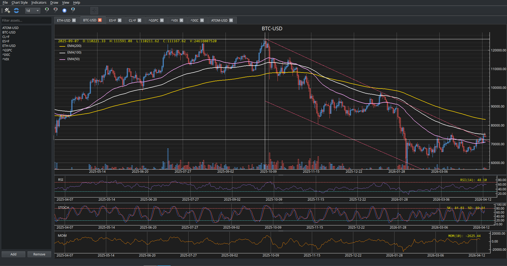

# pystalker
A trading analysis software, it is a port of the old and discontinued Qtstalker.




# Description of the project

Around 2005/2006 a tranding analisys program was bundled with Debian Linux distributions, this was the time I discovered Qtstalker.

The program was very good and very advanced to its time, took a very good advantage of the LibQT3 library and it can work with lots of external resources such Yahoo API, CSV data, CME data and NYBot data.

Around 2010 there was the begin of a new version that changed all the behaviour of the program, but never was released, I personally talked with the main developer Stefan Stratigakos about this new version, but some time later I discovered that the program was discontinued and the project abandoned.

I worked almost every day with qtstalker, I built some infrastructure of data ingestion in real time to feed qtstalker every minute and worked with trading graphics in almost real time, I reverse-engineered my own broker to get real-time data from futures, CFDs, commodities and Forex, my infrastructure is still alive and I made fail-safe against every possible problem with receiving data, from a electric cut to a connection loss, my system is always feeding Qtstalker with data as far as possible.

I had a real time trading system made with my own hands shared with free open source software and I was very proud of it, at that time platforms like Trading View didin't exist, and many others famous platforms as well.

This project is done with a wish of recover that project and make it open source software because I search for a new similar project and didn't find anything that can compare with Qtstalker and I want to make some improvements I had in mind at the time I was using Qtstalker.

I only have a very basic knowledge of C++ and LibQT, I am mainly a python developer, so with AI and agentic development I tried to recover this project with some stages:

1.- I tried to compile Qtstalker inside a very old Debian distribution in docker, get the binary in my current and modern Ubuntu system, and copied all the old LibQT3 libraries in my system, good but not satisfactory at all.
2.- I tried to port the original Qtstalker program from LibQT3 to LibQT5 using OpenCode, Ollama and GLM-5 model, got some good results but not satisfactory at all.
3.- Then I tried to program a C++ LibQT5/6 port from scratch telling AI to make the same program as the qtstalker original code, still not satisfactory.
4.- My final try was to make a python program with PyQT6 to emulate the same behaviour of the original program, and providing the AI agent with the original code, it seems that this time the result was good.

When I wrote this README, the project is still in a very early stage, has lots of bugs, many functions are not working and there is a long trip to get the program finished and in the stage of what I would consider finished, but I want to share the code with the communinty and see if there are people interested on the project and able to contribute to it, in the current state it is really usable and can deliver results.


# Features

- Downaloads data from Yahoo Finance (only daily data), future support for CSV data and possibly other data source endpoints, also in real time!
- Overlay technical indicators: Simple Moving Average, Exponential Moving Average, Bollinguer Bands, Parabollic SAR.
- Stacked technical indicators: MACD, RSI, CCI, ADX, ATR, Momentum, ROC, Stochastic, Stochastic RSI, WILLR, OBV, MFI.
- Drawings: Trendlines, Horizontal lines, Vertical lines, future support for fibonacci drawings.
- Types of graphs: Lines, candles, Heikin Ashi, future support for open candles.


# Running the program

Some parts of this project are C++ (from PyQT6) to improve speed to avoid the python slowing but you don't need to compile anything, I recommend to install PyQT6 libraries (if you still don't have on your Linux system) and create a virtual environment and run the program:

```
virtualenv venv
source venv/bin/activate
pip install -r requirements.txt
./pystalker_run.py
```

Or you can simply run directly without a virtual envinronment (not recommended):

```
pip install -r requirements.txt
./pystalker_run.py
```

It is not necessary to create the virtual environment but recommended.

I hope you like and enjoy this project, I promise to extend and maintain it.


# Configuration

This program will create a directory .pystalker in your home directory and it will create a little SQLite3 database to store the program configuration and the prices database.


Regards

Juan Luis Martínez

